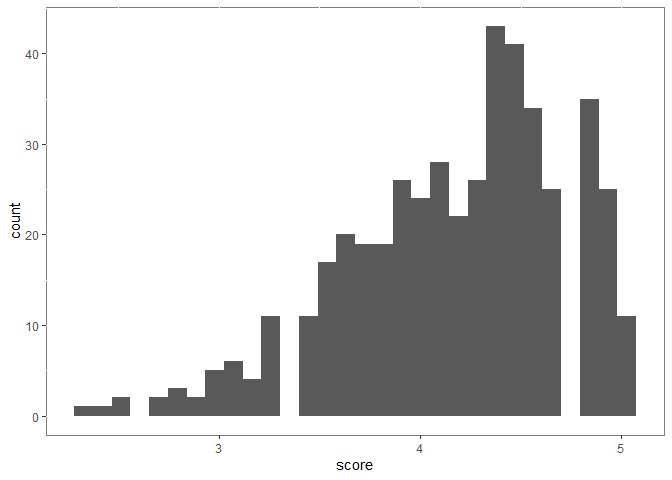
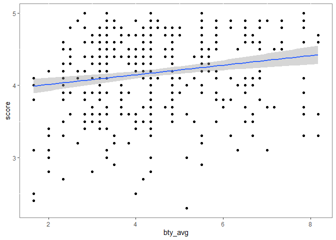
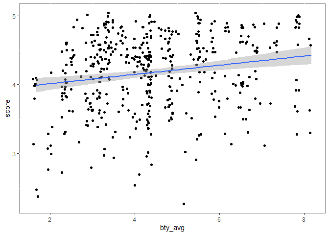
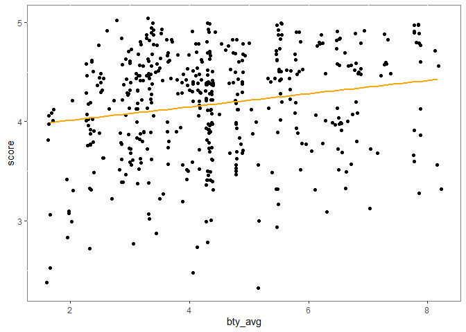
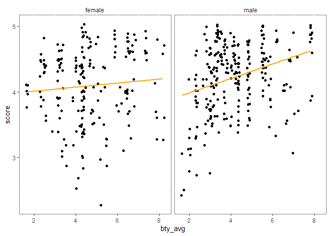

Lab 09 - Grading the professor, Pt. 1
================
Colin Li
03/28/2023

### Load packages and data

``` r
library(tidyverse) 
```

    ## Warning: package 'tidyverse' was built under R version 4.2.3

    ## Warning: package 'ggplot2' was built under R version 4.2.3

    ## Warning: package 'tibble' was built under R version 4.2.3

    ## Warning: package 'tidyr' was built under R version 4.2.3

    ## Warning: package 'readr' was built under R version 4.2.3

    ## Warning: package 'purrr' was built under R version 4.2.3

    ## Warning: package 'dplyr' was built under R version 4.2.3

    ## Warning: package 'forcats' was built under R version 4.2.3

    ## Warning: package 'lubridate' was built under R version 4.2.3

``` r
library(tidymodels)
```

    ## Warning: package 'tidymodels' was built under R version 4.2.3

    ## Warning: package 'broom' was built under R version 4.2.3

    ## Warning: package 'dials' was built under R version 4.2.3

    ## Warning: package 'infer' was built under R version 4.2.3

    ## Warning: package 'modeldata' was built under R version 4.2.3

    ## Warning: package 'parsnip' was built under R version 4.2.3

    ## Warning: package 'recipes' was built under R version 4.2.3

    ## Warning: package 'rsample' was built under R version 4.2.3

    ## Warning: package 'tune' was built under R version 4.2.3

    ## Warning: package 'workflows' was built under R version 4.2.3

    ## Warning: package 'workflowsets' was built under R version 4.2.3

    ## Warning: package 'yardstick' was built under R version 4.2.3

``` r
library(openintro)
```

    ## Warning: package 'openintro' was built under R version 4.2.3

    ## Warning: package 'airports' was built under R version 4.2.3

    ## Warning: package 'cherryblossom' was built under R version 4.2.3

    ## Warning: package 'usdata' was built under R version 4.2.3

``` r
library(ggplot2)
```

### Part 1

``` r
ggplot(evals, aes(x = score)) + geom_histogram(bins = 30)  + theme(panel.background = element_rect(fill = "white", colour = "grey50")) 
```

<!-- -->

``` r
View(evals)

ggplot(evals, aes(y = score, x = bty_avg)) + geom_point() + geom_smooth(method = lm) + theme(panel.background = element_rect(fill = "white", colour = "grey50")) 
```

    ## `geom_smooth()` using formula = 'y ~ x'

<!-- -->

``` r
ggplot(evals, aes(y = score, x = bty_avg)) + geom_jitter() + geom_smooth(method = lm) + theme(panel.background = element_rect(fill = "white", colour = "grey50")) 
```

    ## `geom_smooth()` using formula = 'y ~ x'

<!-- --> negatively
skewed

it looks like geom_point sort of overplott (i.e., one point means
multiple data points), whereas geom_jitter shows more data points.

### Part 2

``` r
m_bty <- lm(score~bty_avg, data = evals)
summary(m_bty)
```

    ## 
    ## Call:
    ## lm(formula = score ~ bty_avg, data = evals)
    ## 
    ## Residuals:
    ##     Min      1Q  Median      3Q     Max 
    ## -1.9246 -0.3690  0.1420  0.3977  0.9309 
    ## 
    ## Coefficients:
    ##             Estimate Std. Error t value Pr(>|t|)    
    ## (Intercept)  3.88034    0.07614   50.96  < 2e-16 ***
    ## bty_avg      0.06664    0.01629    4.09 5.08e-05 ***
    ## ---
    ## Signif. codes:  0 '***' 0.001 '**' 0.01 '*' 0.05 '.' 0.1 ' ' 1
    ## 
    ## Residual standard error: 0.5348 on 461 degrees of freedom
    ## Multiple R-squared:  0.03502,    Adjusted R-squared:  0.03293 
    ## F-statistic: 16.73 on 1 and 461 DF,  p-value: 5.083e-05

``` r
ggplot(evals, aes(y = score, x = bty_avg)) + geom_jitter() + geom_smooth(method = lm, color = "orange", se = FALSE) + theme(panel.background = element_rect(fill = "white", colour = "grey50")) 
```

    ## `geom_smooth()` using formula = 'y ~ x'

<!-- --> The slope
means, a 1 unit increase in average beauty rating is associated with
.067 point increase in professors’ course eval score. intercepts means
when the professor’s average beauty rating is 0, the predicted course
eval score is 3.88. I guess it does not fully make sense, because it
looks like the minimum score one can get is 1. R2 means 3.5% of variance
in the score can be explained by average beauty rating, which is not a
large effect size.

### Part 3

``` r
m_gen <- lm(score~gender, data = evals)
summary(m_gen)
```

    ## 
    ## Call:
    ## lm(formula = score ~ gender, data = evals)
    ## 
    ## Residuals:
    ##      Min       1Q   Median       3Q      Max 
    ## -1.83433 -0.36357  0.06567  0.40718  0.90718 
    ## 
    ## Coefficients:
    ##             Estimate Std. Error t value Pr(>|t|)    
    ## (Intercept)  4.09282    0.03867 105.852  < 2e-16 ***
    ## gendermale   0.14151    0.05082   2.784  0.00558 ** 
    ## ---
    ## Signif. codes:  0 '***' 0.001 '**' 0.01 '*' 0.05 '.' 0.1 ' ' 1
    ## 
    ## Residual standard error: 0.5399 on 461 degrees of freedom
    ## Multiple R-squared:  0.01654,    Adjusted R-squared:  0.01441 
    ## F-statistic: 7.753 on 1 and 461 DF,  p-value: 0.005583

``` r
t.test(evals$score~evals$gender)
```

    ## 
    ##  Welch Two Sample t-test
    ## 
    ## data:  evals$score by evals$gender
    ## t = -2.7507, df = 398.7, p-value = 0.006218
    ## alternative hypothesis: true difference in means between group female and group male is not equal to 0
    ## 95 percent confidence interval:
    ##  -0.24264375 -0.04037194
    ## sample estimates:
    ## mean in group female   mean in group male 
    ##             4.092821             4.234328

``` r
#interpretation: on average, male professors are rated .142 higher than female professors. Intercept = female professors' rating 

#equation male: y = 4.09282 + 0.14151
#equation female: y = 4.09282

ggplot(evals, aes(y = score, x = bty_avg)) + geom_jitter() + geom_smooth(method = lm, color = "orange", se = FALSE) + facet_wrap(vars(gender)) + theme(panel.background = element_rect(fill = "white", colour = "grey50")) + theme(strip.background = element_rect(fill="white"))
```

    ## `geom_smooth()` using formula = 'y ~ x'

<!-- -->

``` r
m_rank <- lm(score~rank, data = evals)
summary(m_rank)
```

    ## 
    ## Call:
    ## lm(formula = score ~ rank, data = evals)
    ## 
    ## Residuals:
    ##     Min      1Q  Median      3Q     Max 
    ## -1.8546 -0.3391  0.1157  0.4305  0.8609 
    ## 
    ## Coefficients:
    ##                  Estimate Std. Error t value Pr(>|t|)    
    ## (Intercept)       4.28431    0.05365  79.853   <2e-16 ***
    ## ranktenure track -0.12968    0.07482  -1.733   0.0837 .  
    ## ranktenured      -0.14518    0.06355  -2.284   0.0228 *  
    ## ---
    ## Signif. codes:  0 '***' 0.001 '**' 0.01 '*' 0.05 '.' 0.1 ' ' 1
    ## 
    ## Residual standard error: 0.5419 on 460 degrees of freedom
    ## Multiple R-squared:  0.01163,    Adjusted R-squared:  0.007332 
    ## F-statistic: 2.706 on 2 and 460 DF,  p-value: 0.06786

``` r
#intercept: average rating score of teaching professors = 4.28. Slope tenure track compares tenure tracking professors' rating to teaching professors rating, which is .13 lower than teaching professors'. Slope tenured compares tenured professors to teaching professors, which is .145 lower than teaching professors'.  

evals$rank <- relevel(evals$rank, ref = "tenure track")
m_rank_rlevel <- lm(score ~ rank, data = evals)
summary(m_rank_rlevel)
```

    ## 
    ## Call:
    ## lm(formula = score ~ rank, data = evals)
    ## 
    ## Residuals:
    ##     Min      1Q  Median      3Q     Max 
    ## -1.8546 -0.3391  0.1157  0.4305  0.8609 
    ## 
    ## Coefficients:
    ##              Estimate Std. Error t value Pr(>|t|)    
    ## (Intercept)   4.15463    0.05214  79.680   <2e-16 ***
    ## rankteaching  0.12968    0.07482   1.733   0.0837 .  
    ## ranktenured  -0.01550    0.06228  -0.249   0.8036    
    ## ---
    ## Signif. codes:  0 '***' 0.001 '**' 0.01 '*' 0.05 '.' 0.1 ' ' 1
    ## 
    ## Residual standard error: 0.5419 on 460 degrees of freedom
    ## Multiple R-squared:  0.01163,    Adjusted R-squared:  0.007332 
    ## F-statistic: 2.706 on 2 and 460 DF,  p-value: 0.06786

``` r
#intercept: tenure track professors rating = 4.15, slope teaching shows teaching professors avg rating score is .13 higher than tenure track professors', slope tenured shows tenured professors avg rating score is .02 lower than tenure track professors', neither of the differences are significant. R2 shows 1.2% of variance in score can be explained by rank, it's a very small effect size and marginally significant. 

evals <- evals %>%
  mutate(tenure_eligible = case_when(
    rank %in% c("tenure track", "tenured") ~ "yes",
    rank == "teaching"           ~ "no"

  ))


m_tenure_eligible <- lm(score ~ tenure_eligible, data = evals)
summary(m_tenure_eligible)
```

    ## 
    ## Call:
    ## lm(formula = score ~ tenure_eligible, data = evals)
    ## 
    ## Residuals:
    ##     Min      1Q  Median      3Q     Max 
    ## -1.8438 -0.3438  0.1157  0.4360  0.8562 
    ## 
    ## Coefficients:
    ##                    Estimate Std. Error t value Pr(>|t|)    
    ## (Intercept)          4.2843     0.0536  79.934   <2e-16 ***
    ## tenure_eligibleyes  -0.1406     0.0607  -2.315    0.021 *  
    ## ---
    ## Signif. codes:  0 '***' 0.001 '**' 0.01 '*' 0.05 '.' 0.1 ' ' 1
    ## 
    ## Residual standard error: 0.5413 on 461 degrees of freedom
    ## Multiple R-squared:  0.0115, Adjusted R-squared:  0.009352 
    ## F-statistic: 5.361 on 1 and 461 DF,  p-value: 0.02103

``` r
#intercept: teaching faculty's avg rating = 4.28, slope tenure_eligible yes means tenure eligible faculty members avg rating is .14 lower than teaching faculty's. R2 shows 1.2% of variance in score can be explained by rank, it's a very small effect size, but it's significant.  
```
